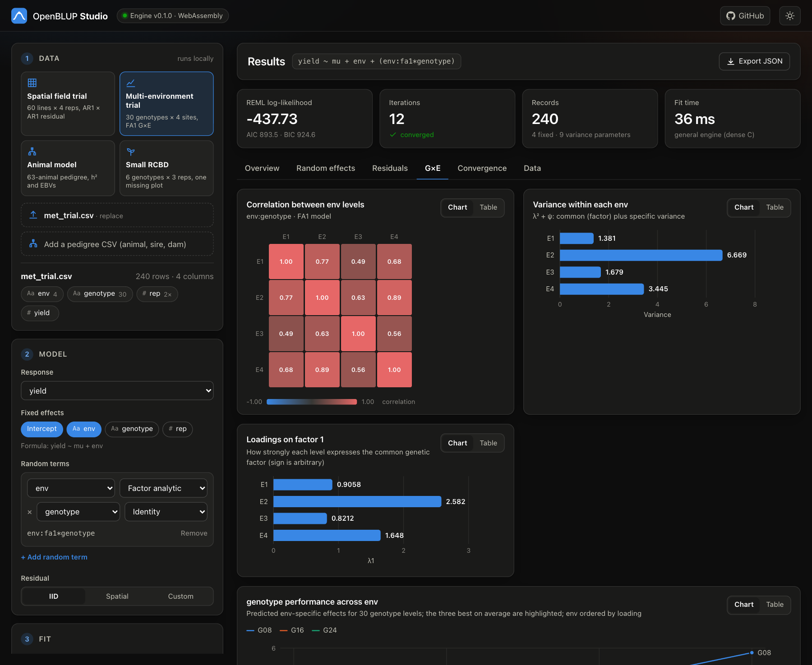
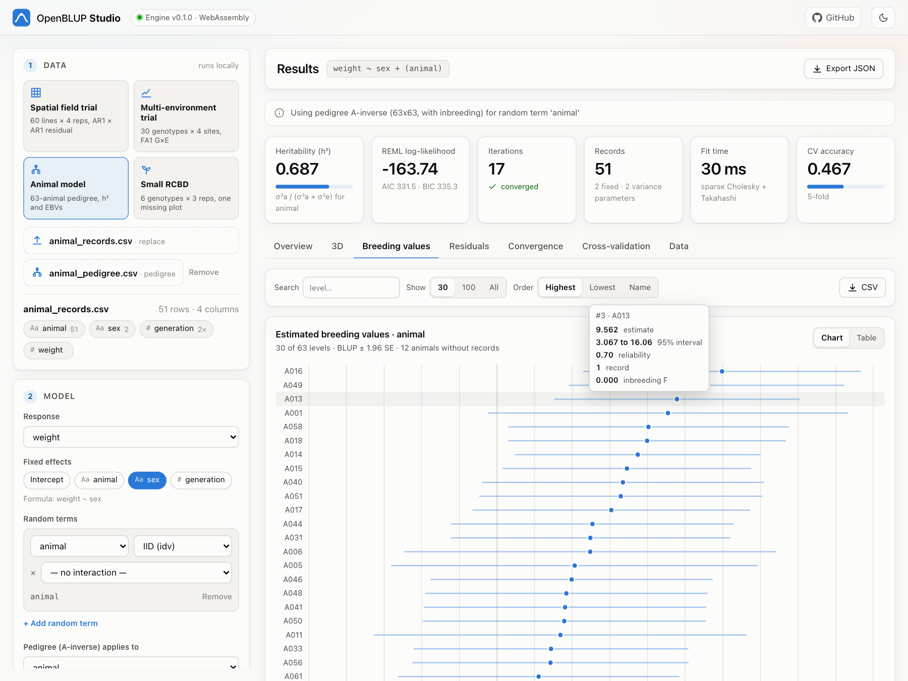
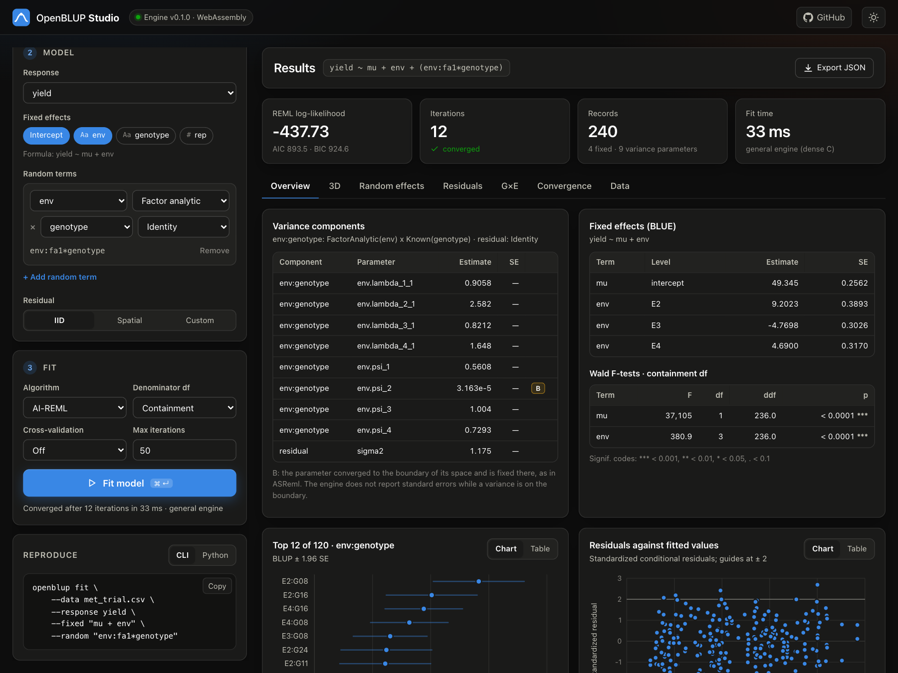
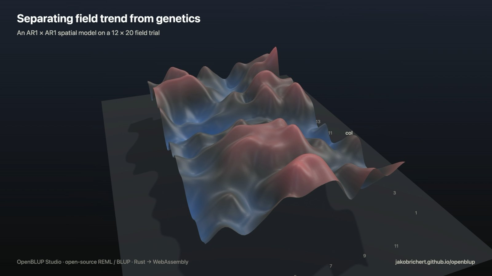
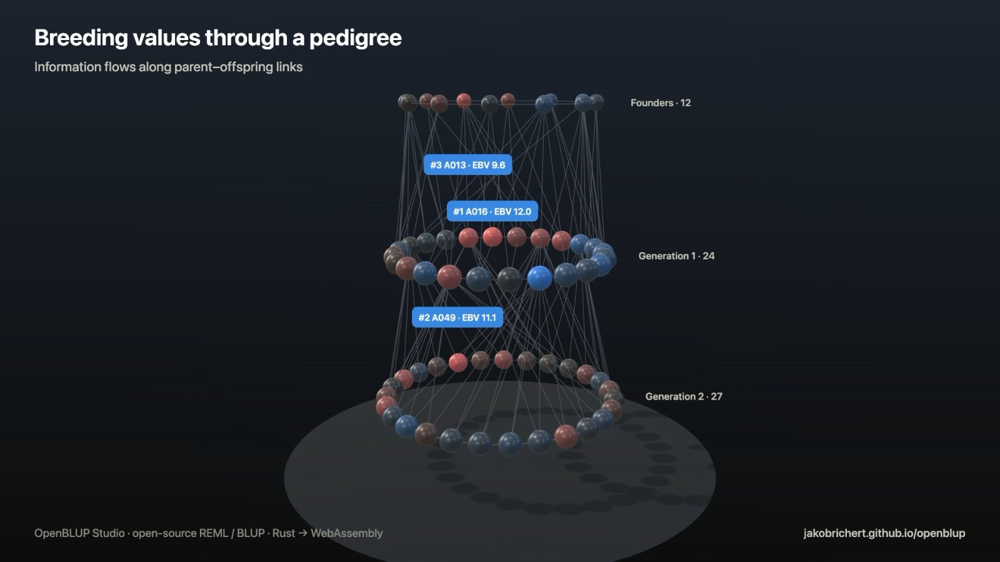

# OpenBLUP

**Open-source REML and BLUP for plant and animal breeding** — a modern linear mixed model engine written in Rust with Python bindings, a command-line tool and a browser app.

**[Open OpenBLUP Studio →](https://jakobrichert.github.io/openblup/)** — the full engine compiled to WebAssembly: build a model, fit it and explore the results in your browser, with nothing to install and no data leaving your machine.


## Why OpenBLUP?

Variance component estimation and breeding value prediction have long depended on [ASReml](https://vsni.co.uk/software/asreml), an excellent but closed, licensed tool. Open alternatives such as [sommer](https://cran.r-project.org/package=sommer) (R) and [MixedModels.jl](https://github.com/JuliaStats/MixedModels.jl) (Julia) cover parts of that ground. OpenBLUP implements the breeding toolbox (AI-REML, pedigree and genomic relationship matrices, spatial and factor-analytic models, multi-trait models) from scratch in Rust, so that the algorithms can be inspected, tested against published examples, embedded in other software and run anywhere, from a Python notebook to a browser tab.

## Features

**Estimation**
- **AI-REML** (Average Information) with exact REML scores, a likelihood safeguard and EM fallback; EM-REML as an alternative. Parameters that reach zero are fixed at the boundary and flagged (like ASReml's `B`)
- A **general multi-parameter engine** for any combination of the variance structures below, in random terms, `outer:inner` interactions (`Σ_outer ⊗ Σ_inner`, optionally with a pedigree inner factor) and the residual, validated against dense reference likelihoods and numerical gradients
- **Sparse mixed model equations**: fixed-pattern assembly, a multithreaded supernodal Cholesky (faer) and a supernodal selected inversion for the traces, prediction error variances and leverages REML needs (see [Performance](#performance))
- BLUEs and BLUPs with standard errors and reliabilities, the full fixed-effects covariance, treatment contrasts (`mu + rep` is full rank, like R's `model.matrix`)
- **Wald F-tests** with containment, Satterthwaite or Kenward-Roger degrees of freedom; log-likelihood, AIC, BIC, residual diagnostics (leverages, Cook's distance)
- Missing data: `NA`/empty CSV fields become `NaN`; rows with a missing response are dropped, a missing value anywhere else in the model is an error

**Variance structures**
- Identity, diagonal, unstructured (Cholesky parameterised), factor analytic (FA1, FA2, ... with a Woodbury inverse), AR1 as a variance (`ar1`) or correlation (`ar1c`), known matrices (e.g. a pedigree A-inverse)
- Kronecker products: AR1 x AR1 spatial residuals over a row x column grid (missing plots allowed), FA x genotype or pedigree for G×E, `US(trait) ⊗ A` for multi-trait animal models
- Every parameter is reported with its standard error from the inverse average-information matrix and a boundary flag

**Genetics**
- Pedigree parsing, validation and sorting; Henderson's A-inverse with Meuwissen & Luo (1992) inbreeding; ancestors without records get breeding values. Validated against Mrode (2005) Example 3.1
- Genomic relationships: VanRaden (2008) G, blending with A22, single-step H-inverse (Legarra et al. 2009, Aguilar et al. 2010)
- Multi-trait models (long format through the general engine, or the wide-format EM-REML engine), genetic correlations, eigenvalue bending
- RR-BLUP marker effects with exact REML (EMMA-style), Smith-Hazel, restricted and desired-gains selection indices
- k-fold, stratified and leave-one-out cross-validation (accuracy, bias, MSEP)

**Interfaces**
- **Rust** library (`plant-breeding-lmm-core`) with a builder API
- **Python** package `openblup` (PyO3): numpy, scipy.sparse and pandas interop, type stubs
- **CLI** `openblup fit` / `openblup ainverse`: term specs such as `--random "env:fa1*genotype"` and `--residual "row:ar1*col:ar1c"`, text or JSON output, BLUP export
- **[OpenBLUP Studio](#openblup-studio)**: the whole engine compiled to WebAssembly, in the browser
- A small standalone WebAssembly crate (`crates/wasm`) with a JSON API for the A-inverse, single-term EM-REML and the G-matrix

## OpenBLUP Studio

[OpenBLUP Studio](https://jakobrichert.github.io/openblup/) is a web app for fitting and exploring mixed models without writing code. It runs the same engine as the CLI and the Python package, compiled to WebAssembly, entirely in the browser.

| Multi-environment trial: FA1 genetic correlations and reaction norms | Animal model: estimated breeding values with 95 % intervals |
|---|---|
|  |  |



### 3D views

The **3D** tab renders the fit itself, not decoration:

| REML likelihood landscape | Spatial field trend | Pedigree |
|---|---|---|
|  |  |  |
| The restricted log-likelihood over any two variance parameters, evaluated by the engine, with the AI-REML iterations climbing to the maximum and the 95 % joint confidence region | Plots as columns on the field, the fitted AR1 x AR1 residual as a terrain, and the yields with that trend removed, animated between the three | Generations as rings, parent–offspring links and breeding values; hovering an animal traces its ancestors and descendants |

Multi-environment trials also get 3D genotype-by-environment reaction norms. Every 3D view can be exported as a PNG or recorded as a 1080p clip of one full orbit.

- Runs the engine in a Web Worker; your data never leave the machine
- Start from one of the built-in analyses (spatial field trial, multi-environment trial, pedigree animal model, RCBD) or drop in your own CSV and pedigree
- Pick the response, fixed effects, random terms with a variance structure per factor (`idv`, `diag`, `us`, `fa1`–`fa3`, `ar1`, `ar1c`), interactions, a pedigree term and an IID, AR1 x AR1 or custom residual
- Variance components, BLUEs and Wald tests, ranked BLUPs / EBVs, residual diagnostics, field maps, FA genetic correlations, convergence and cross-validation views
- Every model is shown as the equivalent CLI command and Python code; every chart has a table view, and results export to JSON (BLUPs to CSV)

Run it locally:

```bash
rustup target add wasm32-unknown-unknown
cargo install wasm-bindgen-cli --version 0.2.128 --locked   # must match Cargo.lock
studio/build.sh
python3 -m http.server --directory studio 8000             # open http://localhost:8000
```

See [studio/README.md](studio/README.md) for details.

## Quick Start (Rust)

This is `crates/core/examples/quick_start.rs`; run it with
`cargo run -p plant-breeding-lmm-core --example quick_start`.

```rust
use plant_breeding_lmm_core::data::DataFrame;
use plant_breeding_lmm_core::genetics::Pedigree;
use plant_breeding_lmm_core::model::MixedModelBuilder;
use plant_breeding_lmm_core::variance::Identity;

fn main() -> plant_breeding_lmm_core::Result<()> {
    // Load data; numeric columns with NA become NaN, so drop missing plots first.
    let mut df = DataFrame::from_csv("examples/field_trial.csv")?.drop_missing("yield")?;
    df.as_factor("rep")?; // rep is coded 1, 2, 3 in the file

    // yield = mu + rep (fixed, treatment contrasts) + genotype (random, IID) + error
    let mut model = MixedModelBuilder::new()
        .data(&df)
        .response("yield")
        .fixed("mu + rep")
        .random("genotype", Identity::new(1.0), None)
        .build()?;
    let result = model.fit_reml()?;
    println!("{}", result.summary());

    // Animal model: the random term follows the pedigree (all animals get a BLUP,
    // including the 12 founders without records)
    let records = DataFrame::from_csv("examples/animal_records.csv")?;
    let ped = Pedigree::from_csv("examples/animal_pedigree.csv")?;
    let mut model = MixedModelBuilder::new()
        .data(&records)
        .response("weight")
        .fixed("sex")
        .random_pedigree("animal", Identity::new(1.0), &ped)
        .build()?;
    let result = model.fit_reml()?;
    println!("{}", result.summary());
    Ok(())
}
```

## Quick Start (Python)

```bash
# Install (requires the Rust toolchain)
pip install .            # or: pip install maturin && maturin develop --release
```

```python
from openblup import MixedModel, Pedigree, compute_a_inverse, compute_g_matrix

# Fit a simple mixed model
model = MixedModel()
model.load_csv("examples/field_trial.csv")   # rows with a missing response are dropped at fit time
model.as_factor("rep")                        # numeric codes -> categorical
model.set_response("yield")
model.add_fixed("mu + rep")
model.add_random("genotype")
result = model.fit()
print(result.summary())
print(result.variance_components())           # {'genotype': ..., 'residual': ...}
print(result.wald_tests(ddf="kenward-roger")) # or "containment", "satterthwaite"
print(result.residual_diagnostics()["cooks_distance"])
print(model.cross_validate(n_folds=5, seed=1)["accuracy"])

# Animal model with a pedigree relationship matrix
ped = Pedigree.from_csv("examples/animal_pedigree.csv")
model = MixedModel()
model.load_csv("examples/animal_records.csv")
model.set_response("weight")
model.add_fixed("sex")
model.add_random_pedigree("animal", ped)      # A-inverse with inbreeding, pedigree ordering
result = model.fit()
blups = dict(zip(result.random_effect_levels()["animal"], result.random_effects()["animal"]))
print(result.variance_components_se())        # SEs from the inverse AI matrix
print(result.at_boundary())                   # parameters that converged to zero

# Multi-environment trial: factor-analytic genotype-by-environment term
model = MixedModel()
model.load_csv("examples/met_trial.csv")
model.set_response("yield")
model.add_fixed("mu + env")
model.add_random_interaction("env", "genotype", outer_structure="fa1")
result = model.fit()
for p in result.variance_parameters():        # loadings, specific variances, residual: value, se, at_boundary
    print(p["component"], p["name"], round(p["value"], 3), round(p["se"], 3))

# Spatial analysis: AR1 x AR1 residual over the field grid, genotype random
model = MixedModel()
model.load_csv("examples/field_trial.csv")
model.as_factor("rep")
model.set_response("yield")
model.add_fixed("mu + rep")
model.add_random("genotype")
model.set_residual_interaction("row", "col", "ar1", "ar1c")
print(model.fit().summary())

# Multi-trait animal model in long format (one row per trait x animal; `unit` = animal id):
# genetic covariance G0 (x) A, residual covariance R0 (x) I
model = MixedModel()
model.load_csv("two_trait_long.csv")          # columns: trait, animal, unit, y
model.set_response("y")
model.add_fixed("trait")
model.add_random_interaction("trait", "animal", outer_structure="us", pedigree=ped)
model.set_residual_interaction("trait", "unit", "us", "fixed")
result = model.fit()                          # parameters trait.L_r_c are Cholesky factors of G0 and R0

# Relationship matrices directly
a_inv = compute_a_inverse(ped)                # scipy.sparse.csc_matrix (rows = ped.animal_ids())
g = compute_g_matrix(markers_0_1_2)           # numpy (n x n)

# pandas
model = MixedModel()
model.set_dataframe(df)                       # numeric -> float, everything else -> factor
```

## Quick Start (CLI)

```bash
# Fit a model from the command line (rep is numeric in the file, so mark it as a factor)
openblup fit --data examples/field_trial.csv --response yield \
    --fixed "mu + rep" --factor rep --random genotype

# Animal model with pedigree: all 63 pedigree animals get a breeding value
openblup fit --data examples/animal_records.csv --response weight \
    --fixed sex --random animal --pedigree examples/animal_pedigree.csv \
    --format json --blups breeding_values.csv

# Multi-environment trial: FA1 genotype-by-environment interaction
openblup fit --data examples/met_trial.csv --response yield \
    --fixed "mu + env" --random "env:fa1*genotype"

# Spatial analysis: AR1 x AR1 residual over the row x column grid
openblup fit --data examples/field_trial.csv --response yield \
    --fixed "mu + rep" --factor rep --random genotype --residual "row:ar1*col:ar1c"

# Satterthwaite df, 5-fold cross-validation and residual diagnostics
openblup fit --data examples/field_trial.csv --response yield \
    --fixed "mu + rep" --factor rep --random genotype \
    --ddf satterthwaite --cv 5 --diagnostics diagnostics.csv

# Multi-trait animal model in long format (columns trait, animal, unit, y):
# G0 (x) A for trait:animal, R0 (x) I over the trait x unit grid
openblup fit --data two_trait_long.csv --response y --fixed trait \
    --random "trait:us*animal" --pedigree ped.csv --pedigree-term animal \
    --residual "trait:us*unit:fixed"

# Inspect the A-inverse and inbreeding coefficients
openblup ainverse --pedigree examples/mrode_pedigree.csv --inbreeding --output ainv.csv
```

A random term is `factor[:structure]` or an interaction `factor[:structure]*factor[:structure]`
with structures `idv` (default), `ar1`/`ar1(rho)`, `ar1c` (correlation only), `diag`, `us`,
`fa1`, `fa2`, ... A pedigree attaches to the factor named by `--pedigree-term`
(e.g. `--random "env:diag*animal" --pedigree ped.csv --pedigree-term animal`).
Run `openblup fit --help` for all options (`--algorithm em`, `--max-iter`, `--tolerance`, ...).

## Performance

Models with an IID residual (animal, genomic and plant-trial models) run on the sparse path: the MME pattern and its fill-reducing ordering are analysed once per fit, every AI-REML iteration is one multithreaded supernodal Cholesky factorization plus one selected inversion, and likelihood-only evaluations skip the inversion. Pedigree animal models, `y = sex + animal`, fitted to convergence with AI-REML (`animal_model_benchmark` example, Apple M5 Pro):

| Animals | Records | Pedigree structure | Fit | Iterations |
|---:|---:|---|---:|---:|
| 20 000 | 18 000 | 2% of each generation used as sires | 0.12 s | 5 |
| 60 000 | 54 000 | 2% of each generation used as sires | 0.46 s | 5 |
| 100 000 | 90 000 | 2% of each generation used as sires | 1.0 s | 5 |
| 20 000 | 18 000 | random mating (no structure, much more fill-in) | 3.3 s | 5 |
| 60 000 | 54 000 | random mating | 52 s | 5 |

The cost is set by the fill-in of the Cholesky factor, i.e. by the pedigree structure, more than by the number of animals: the densest block of the factor (the top separator) is factorized and inverted densely in every iteration. Reproduce with

```bash
cargo run --release -p plant-breeding-lmm-core --example animal_model_benchmark -- 20000 60000 100000
cargo run --release -p plant-breeding-lmm-core --example animal_model_benchmark -- --mating random 20000
```

Models on the general engine (structured residuals, FA / unstructured terms) still assemble `C` densely: a 40 x 80 AR1 x AR1 field trial takes about a minute and a 500-genotype FA1 MET about a minute and a half. Making that engine sparse is next on the [roadmap](#status-and-roadmap).

## Building

```bash
# Requires Rust 1.84+ (CI runs stable on Linux, macOS and Windows)
cargo build --release

# Run all Rust tests (core unit tests, integration tests, CLI end-to-end tests, wasm crate)
cargo test --workspace

# Large-scale check (4 000-animal pedigree model) — ignored by default, run in release mode
cargo test --release -p plant-breeding-lmm-core --test sparse_mme_test -- --ignored

# Scaling benchmark of the sparse animal-model path (see Performance)
cargo run --release -p plant-breeding-lmm-core --example animal_model_benchmark

# Lints used in CI
cargo fmt --all -- --check
cargo clippy --workspace --all-targets -- -D warnings

# Build the CLI (binary: target/release/openblup)
cargo build --release -p plant-breeding-lmm-cli

# Build and test the Python package
pip install maturin numpy scipy
maturin develop --release
python -m pytest python/tests

# Build the small WebAssembly crate and its demo page (Studio: see above)
rustup target add wasm32-unknown-unknown
cargo install wasm-pack
wasm-pack build crates/wasm --target web --out-dir www/pkg
python3 -m http.server --directory crates/wasm/www   # then open http://localhost:8000
```

## Architecture

```
openblup/
├── crates/
│   ├── core/                 # Pure Rust library (plant-breeding-lmm-core), examples/ incl. the benchmark
│   │   ├── data/             # DataFrame, Factor columns, CSV I/O (NA handling)
│   │   ├── matrix/           # Sparse ops, supernodal Cholesky + selected inversion, dense helpers
│   │   ├── model/            # Builder API, design matrices (treatment contrasts), multi-trait
│   │   ├── lmm/              # MME, AI-REML, EM-REML, general engine, BLUP utilities
│   │   ├── variance/         # AR1, Diagonal, Unstructured, Kronecker, Factor Analytic
│   │   ├── genetics/         # Pedigree, A/G/H matrices, RR-BLUP, selection indices
│   │   ├── diagnostics/      # Wald tests, Satterthwaite df, residuals, cross-validation
│   │   └── gpu/              # Feature-gated GPU backend interface (CPU fallback)
│   ├── python-bindings/      # PyO3 extension module (openblup._internal)
│   ├── cli/                  # Command-line tool (clap) + end-to-end tests
│   ├── wasm/                 # Small WebAssembly target (wasm-bindgen) + demo page
│   └── studio/               # Full engine for the browser (OpenBLUP Studio)
├── studio/                   # OpenBLUP Studio web app (ES modules, no bundler)
├── python/
│   ├── openblup/             # Python package (wrappers, type stubs)
│   └── tests/                # Python test suite
├── examples/                 # Example data (field trials, MET trial, Mrode and simulated pedigrees)
├── docs/images/              # Screenshots
└── .github/workflows/        # CI: fmt, clippy, tests on 3 platforms, wasm, Python, benchmark; Studio build + Pages deploy
```

## Algorithms & References

The algorithms implemented here are based on well-established quantitative genetics literature:

### Core REML & Mixed Model Theory
- **Henderson, C.R.** (1984). *Applications of Linear Models in Animal Breeding*. University of Guelph. — The foundational text for mixed model equations in breeding.
- **Patterson, H.D. & Thompson, R.** (1971). Recovery of inter-block information when block sizes are unequal. *Biometrika*, 58(3), 545-554. — Original REML paper.
- **Searle, S.R., Casella, G. & McCulloch, C.E.** (1992). *Variance Components*. Wiley. — Comprehensive treatment of variance component estimation.
- **Gilmour, A.R., Thompson, R. & Cullis, B.R.** (1995). Average Information REML: An efficient algorithm for variance parameter estimation in linear mixed models. *Biometrics*, 51(4), 1440-1450. — AI-REML algorithm used in ASReml.
- **Kenward, M.G. & Roger, J.H.** (1997). Small sample inference for fixed effects from restricted maximum likelihood. *Biometrics*, 53(3), 983-997. — Bias-adjusted covariance, scaled F and denominator df; Satterthwaite df follow Giesbrecht & Burns (1985) and Fai & Cornelius (1996) for multi-df terms.
- **Takahashi, K., Fagan, J. & Chin, M.-S.** (1973). Formation of a sparse bus impedance matrix and its application to short circuit study. *Proc. 8th PICA Conference*, 63-69. — The recurrences behind the selected inversion used for the traces and prediction error variances (here in supernodal form, as in Masuda, Baba & Suzuki 2014, *Journal of Animal Breeding and Genetics*).

### Pedigree & Relationship Matrices
- **Henderson, C.R.** (1976). A simple method for computing the inverse of a numerator relationship matrix used in prediction of breeding values. *Biometrics*, 32(1), 69-83. — Henderson's rules for A-inverse.
- **Meuwissen, T.H.E. & Luo, Z.** (1992). Computing inbreeding coefficients in large populations. *Genetics, Selection, Evolution*, 24(4), 305-313. — Efficient inbreeding algorithm.
- **Mrode, R.A.** (2005). *Linear Models for the Prediction of Animal Breeding Values* (2nd ed.). CABI Publishing. — Standard textbook; our integration tests validate against examples from this book.
- **Quaas, R.L.** (1976). Computing the diagonal elements and inverse of a large numerator relationship matrix. *Biometrics*, 32(4), 949-953.

### Genomic Selection
- **VanRaden, P.M.** (2008). Efficient methods to compute genomic predictions. *Journal of Dairy Science*, 91(11), 4414-4423. — G-matrix construction (Method 1).
- **Legarra, A., Aguilar, I. & Misztal, I.** (2009). A relationship matrix including full pedigree and genomic information. *Journal of Dairy Science*, 92(9), 4656-4663. — Single-step H-matrix.
- **Kang, H.M., Zaitlen, N.A., Wade, C.M., Kirby, A., Heckerman, D., Daly, M.J. & Eskin, E.** (2008). Efficient control of population structure in model organism association mapping. *Genetics*, 178(3), 1709-1723. — EMMA: REML over one variance ratio via an eigendecomposition (used for RR-BLUP).
- **Endelman, J.B.** (2011). Ridge regression and other kernels for genomic selection with R package rrBLUP. *The Plant Genome*, 4(3), 250-255.
- **Aguilar, I., Misztal, I., Johnson, D.L., Legarra, A., Tsuruta, S. & Lawlor, T.J.** (2010). Hot topic: A unified approach to utilize phenotypic, full pedigree, and genomic information for genetic evaluation of Holstein final score. *Journal of Dairy Science*, 93(2), 743-752.

### Spatial Analysis
- **Gilmour, A.R., Cullis, B.R. & Verbyla, A.P.** (1997). Accounting for natural and extraneous variation in the analysis of field experiments. *Journal of Agricultural, Biological, and Environmental Statistics*, 2(3), 269-293. — AR1xAR1 spatial models.
- **Smith, A., Cullis, B.R. & Thompson, R.** (2005). The analysis of crop cultivar breeding and evaluation trials: an overview of current mixed model approaches. *Journal of Agricultural Science*, 143(6), 449-462.

### Multi-Environment & Factor Analytic Models
- **Smith, A., Cullis, B.R. & Thompson, R.** (2001). Analyzing variety by environment data using multiplicative mixed models and adjustments for spatial field trend. *Biometrics*, 57(4), 1138-1147. — Factor analytic models for MET.
- **Thompson, R., Cullis, B.R., Smith, A. & Gilmour, A.R.** (2003). A sparse implementation of the Average Information algorithm for factor analytic and reduced rank variance models. *Australian & New Zealand Journal of Statistics*, 45(4), 445-459.

### Software Comparison
- **Butler, D.G., Cullis, B.R., Gilmour, A.R. & Gogel, B.J.** (2009). *ASReml-R Reference Manual*. VSN International. — The proprietary reference implementation.
- **Covarrubias-Pazaran, G.** (2016). Genome-assisted prediction of quantitative traits using the R package sommer. *PLoS ONE*, 11(6), e0156744. — Open-source R alternative.

## Comparison with Existing Tools

| | ASReml | sommer (R) | MixedModels.jl | **OpenBLUP** |
|---|---|---|---|---|
| Open source | No | Yes | Yes | **Yes** (MIT / Apache-2.0) |
| Implementation | Fortran | R / C++ | Julia | **Rust** |
| Interfaces | R, standalone | R | Julia | **Rust, Python, CLI, browser** |
| AI-REML | Yes | Yes | No | **Yes** |
| Pedigree and genomic relationship matrices | Yes | Yes | No | **Yes** (A-inverse, G, single-step H) |
| AR1 x AR1 spatial models | Yes | Yes | No | **Yes** |
| Factor analytic G×E | Yes | Limited | No | **Yes** |
| Runs in the browser | No | No | No | **Yes** ([Studio](https://jakobrichert.github.io/openblup/)) |

ASReml remains the reference for speed on large structured models; see [Performance](#performance) for where OpenBLUP stands.

## Status and roadmap

What works well today, and what is missing:

- **Sparse path (done).** Models with an IID residual (animal, genomic and plant-trial models) use sparse MME, a supernodal Cholesky and a selected inversion; tens of thousands of animals fit in seconds.
- **Next: a sparse general engine.** Models with structured residuals or dense variance structures (AR1 x AR1 residuals, FA / unstructured terms) use the general engine, which assembles and inverts `C` densely; keep those to a few thousand equations for now. The plan is to give them the same sparse treatment (sparse `R⁻¹` for AR1 x AR1 and long-format multi-trait residuals, sparse Kronecker blocks, the shared supernodal factorization), so large spatial and MET analyses scale like the animal model does.
- **Later: very large evaluations.** Beyond what a direct factorization handles (millions of equations): iterative (PCG) solutions and Monte-Carlo REML traces, so no inverse is needed at all, and nested-dissection orderings for less fill-in.
- **Known gaps.**
  - The wide-format multi-trait engine (`MultiTraitReml`) is EM-only; fit multi-trait models in long format through the general engine (`trait:us*animal` with a `trait:us*unit:fixed` residual, see the quick starts) for AI-REML, standard errors and diagnostics. That residual is dense, so keep it to a few thousand records.
  - Satterthwaite df need the average-information matrix with no parameter on the boundary; Kenward-Roger also needs scaled-identity / relationship-matrix terms and an IID residual; leverage diagnostics need an IID residual. Unavailable methods fall back to the next simpler one, and the output says which.
  - When a variance parameter sits at zero, the general engine reports no standard errors.
  - `--cv` / `cross_validate()` handle a single random term.
  - The `gpu` feature is an interface only; everything runs on the CPU.

[CONTRIBUTING.md](CONTRIBUTING.md#where-to-help) lists these as places to help.

## Contributing

Contributions are welcome, from code to validation reports. See **[CONTRIBUTING.md](CONTRIBUTING.md)** for the development setup, conventions (standard quantitative-genetics notation), testing requirements (new algorithms must be validated against a textbook or another tool) and the pull request process.

The most valuable help right now: **validation** (the same model in OpenBLUP and ASReml or sommer, compared), the **sparse general engine**, and **tutorials** from real breeding programs (dairy, wheat, maize, forestry). Bug reports and feature requests go through the [issue templates](.github/ISSUE_TEMPLATE/).

## Licence

Dual-licensed under [MIT](LICENSE-MIT) or [Apache 2.0](LICENSE-APACHE), at your option.

## Acknowledgements

This project draws on decades of quantitative genetics research. We are grateful to the scientists who developed and published these algorithms, and to the ASReml team whose software set the standard for mixed model analysis in breeding.
