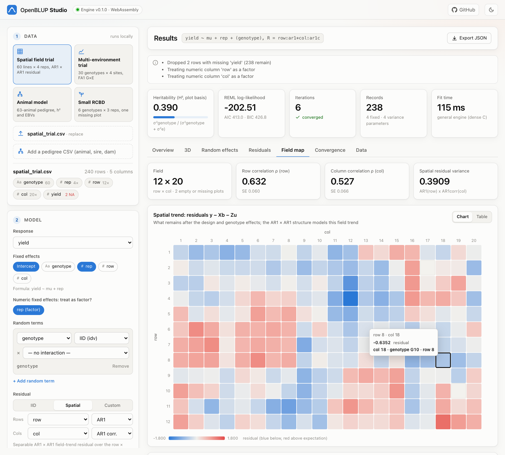

# OpenBLUP Studio

A browser interface for OpenBLUP. The complete engine (AI-REML, the general
variance-structure engine, sparse MME, Wald tests, diagnostics and
cross-validation) is compiled from Rust to WebAssembly and runs in a Web
Worker, so fits happen on the user's machine and no data is uploaded anywhere.



## What it does

- **Data**: four built-in examples (spatial field trial, multi-environment
  trial, pedigree animal model, small RCBD), or your own CSV plus an optional
  pedigree (`animal,sire,dam`), by file picker or drag and drop
- **Model builder**: response, fixed effects (with a factor/covariate switch for
  numeric columns), any number of random terms with a structure per factor
  (`idv`, `diag`, `us`, `fa1`…`fa3`, `ar1`, `ar1c`) and `a*b` interactions, a
  pedigree term, and an IID, spatial AR1 × AR1 or custom residual
- **Fit options**: AI-REML or EM-REML, containment / Satterthwaite /
  Kenward-Roger denominator df, k-fold cross-validation
- **Results**: heritability, log-likelihood, AIC/BIC and convergence tiles;
  variance components with standard errors and boundary flags; BLUEs and Wald
  F-tests; ranked BLUPs / EBVs with 95 % intervals, reliabilities, record counts
  and inbreeding; residual and Q–Q plots with leverage and Cook's distance; a
  field map of the spatial trend; genetic correlations, variances and FA
  loadings with genotype-by-environment reaction norms; the REML convergence
  path; cross-validation accuracy
- **3D views** (Three.js, loaded on demand): the REML likelihood landscape
  over any two variance parameters, evaluated by the engine, with the AI-REML
  path and the 95 % joint confidence region; the spatial field trend as a
  terrain under the plots, animated against the raw and trend-removed yields;
  the pedigree in 3D coloured by breeding value, with lineage highlighting; and
  G×E reaction norms. Every view exports a PNG or records a 1920 × 1080 clip of
  one orbit (MP4 where the browser can encode it, otherwise WebM)
- **Reproducible**: every model is shown as the equivalent `openblup fit`
  command and Python code; results export to JSON and BLUPs to CSV
- Every chart has a table view, hover and keyboard tooltips, and light and dark
  themes

## Build and run

```bash
rustup target add wasm32-unknown-unknown
# the version must match wasm-bindgen in Cargo.lock
cargo install wasm-bindgen-cli --version 0.2.128 --locked

studio/build.sh                          # -> studio/pkg (engine) + studio/examples
node studio/tests/smoke.mjs              # engine + request builder smoke test
python3 -m http.server --directory studio 8000
# open http://localhost:8000
```

`build.sh` runs `wasm-opt` too when it is installed. Any static file server
works; the page needs to be served over HTTP (not opened as a file) for the
module worker to load. The `Studio` GitHub Actions workflow builds and tests
the app on every pull request and publishes it to GitHub Pages from `main`.

Deep links: `?example=spatial|met|animal|rcbd` loads and fits an example,
`&tab=3d|field|gxe|effects|diagnostics|convergence|cv|data` opens a result view,
`&theme=light|dark` forces a theme.

## How it fits together

```
studio/
├── index.html          # app shell
├── studio.css          # colour tokens (light + dark) and layout
├── js/
│   ├── app.js          # state, data loading, the model-builder sidebar
│   ├── results.js      # result tabs (overview, effects, residuals, field, G×E, ...)
│   ├── charts.js       # SVG charts, tooltips, figure cards with table views
│   ├── three/          # 3D views: stage (renderer, picking, recording) and one module per scene
│   ├── examples.js     # example presets, request builder, CLI/Python code generation
│   ├── engine.js       # promise API over the worker
│   ├── worker.js       # loads pkg/openblup_studio.js and runs inspect/fit
│   ├── dom.js          # tiny DOM helpers (data is always inserted as text)
│   └── format.js       # number formatting
└── tests/smoke.mjs     # Node smoke test of the engine bindings
```

The engine side is `crates/studio` (`openblup-studio`). It exposes three JSON
functions, `inspect(csv)`, `fit(request)` and `likelihood_surface(request,
surface)` (the REML log-likelihood on a grid of two variance parameters, via
`AiReml::log_likelihood_at`); a request carries the CSV text,
an optional pedigree and a `FitSpec` in the CLI's term vocabulary
(`plant_breeding_lmm_core::model::FitSpec`), so the Studio, the CLI and the
engine share one model-specification parser. The response adds what the
charts need on top of the fit: per-record labels, the field grid of a spatial
residual, covariance and correlation matrices of `diag` / `us` / `fa` terms and
pedigree inbreeding coefficients.

The dense general engine is used for structured residuals and FA / US terms,
so keep those models to a few thousand equations in the browser; models with
an IID residual use the sparse solver.
